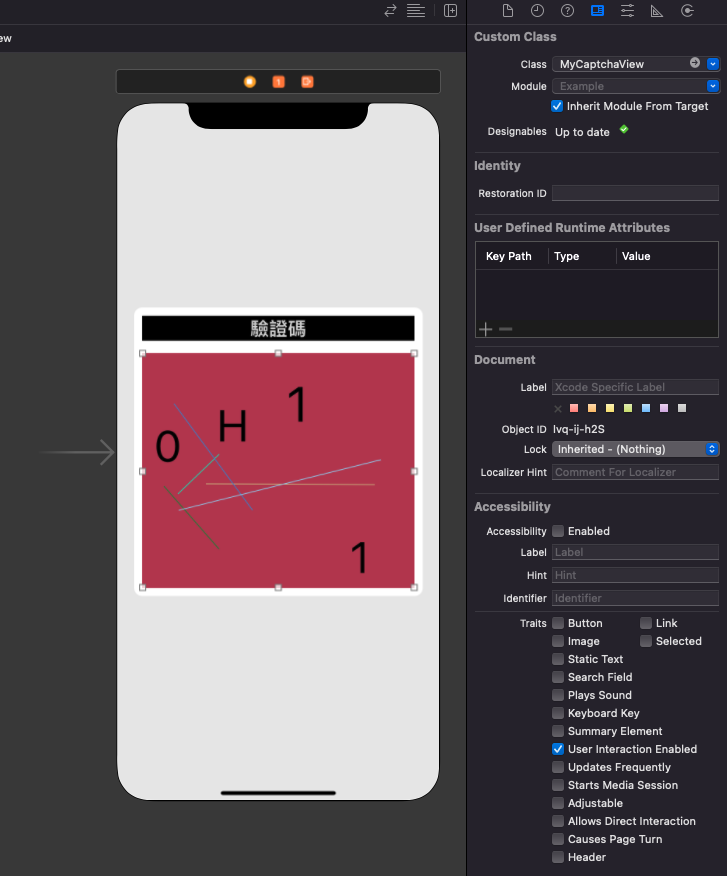
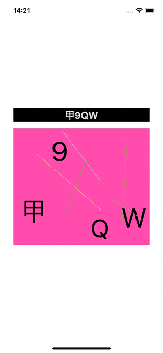

# WWCaptchaView

[](https://developer.apple.com/swift/) [](https://developer.apple.com/swift/)  [](https://developer.apple.com/swift/) [](https://developer.apple.com/swift/)

## [Introduction - 簡介](https://swiftpackageindex.com/William-Weng)
- [CAPTCHA - Completely Automated Public Turing test to tell Computers and Humans Apart](https://zh.wikipedia.org/zh-tw/验证码)
- [全自動區分電腦和人類的圖靈測試（英語：Completely Automated Public Turing test to tell Computers and Humans Apart，簡稱CAPTCHA），又稱驗證碼](https://www.jianshu.com/p/209f08f369a1)





### [Installation with Swift Package Manager](https://medium.com/彼得潘的-swift-ios-app-開發問題解答集/使用-spm-安裝第三方套件-xcode-11-新功能-2c4ffcf85b4b)
```bash
dependencies: [
    .package(url: "https://github.com/William-Weng/WWCaptchaView.git", .upToNextMajor(from: "1.0.2"))
]
```

### [Function - 可用函式](https://zh.wikipedia.org/zh-tw/验证码)
|函式|功能|
|-|-|
|configure(delegate:stringModel:lineModel)|[設定初始值](https://www.jianshu.com/p/209f08f369a1)|
|redrawCaptcha()|重新繪製驗證碼|
|redrawCaptchaString(_:)|重新繪製自訂驗證碼|

### Example
```swift
import UIKit
import WWPrint
import WWCaptchaView

// MARK: - ViewController
final class ViewController: UIViewController {
    
    @IBOutlet weak var captchaLabel: UILabel!
    @IBOutlet weak var captchaView: WWCaptchaView!
    
    private let stringModel: WWCaptchaView.RandomStringModel = .init(
        digits: "ABCDEFGHIJKLMNOPQRSTUVWXYZ1234567890甲乙丙丁戊己庚辛壬癸",
        length: 3,
        font: .systemFont(ofSize: 56),
        upperBound: 10,
        color: .black
    )
    
    private let lineModel: WWCaptchaView.RandomLineModel = .init(
        count: 5,
        width: 1.0
    )
    
    override func viewDidLoad() {
        super.viewDidLoad()
        captchaView.configure(delegate: self, stringModel: stringModel, lineModel: lineModel)
    }
}

// MARK: - WWCaptchaViewDelegate
extension ViewController: WWCaptchaViewDelegate {
    func captcha(view: WWCaptchaView, string: String?) { captchaLabel.text = string }
}
```
